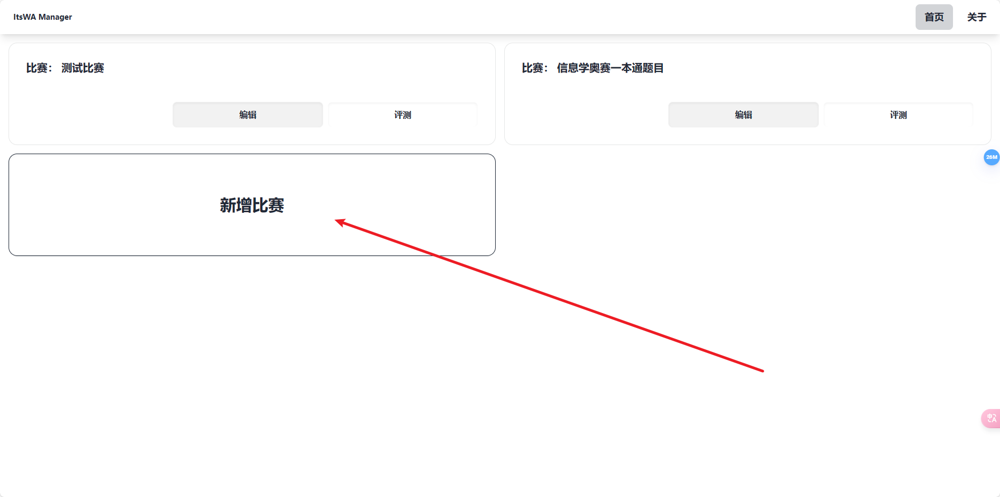
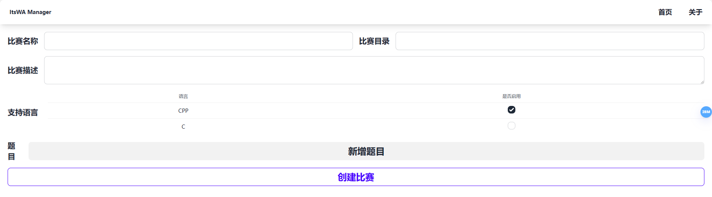

# 初始化比赛

安装完成后，您需要初始化一个ItsWA比赛才能使用。

ItsWA提供两种方式来管理比赛：

1. ItsWA Editor
2. CLI（开发中）

## 使用ItsWA Editor初始化比赛

> 注意：下文中用ITED指代ItsWA Editor。

首先，使用如下命令开启管理API：

```bash
python main.py server
```

然后，ItsWA程序将会检测ITED是否存在并且为最新版本，否则将自动从Github下载ITED。

ITED下载完成后，`ItsWA-Manager`将会输出`INFO:ItsWA-Manager:访问 http://localhost:2568/editor 以访问ItsWA Manager。`。

### 创建比赛

点击创建比赛，然后在其中填入比赛信息。





然后，您可以点击“新增题目”来创建题目，**但是我们更推荐在保存比赛后进行编辑**（因为“比赛编辑器”提供了比“比赛创建器”更多的实用工具）。
