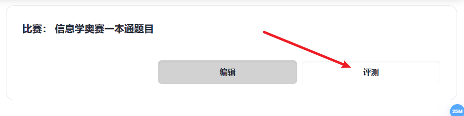
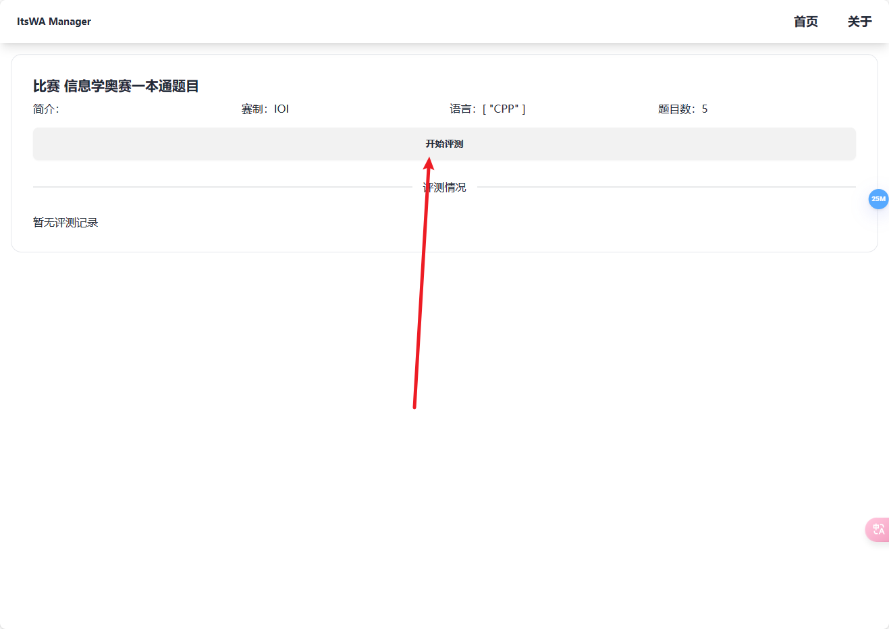
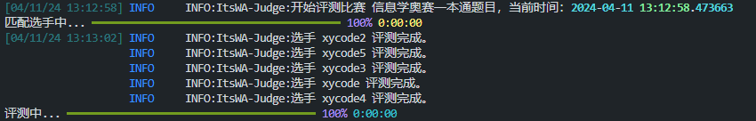
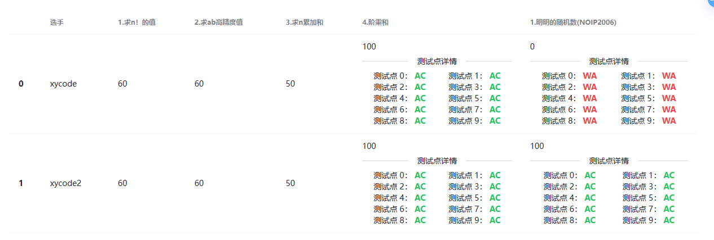
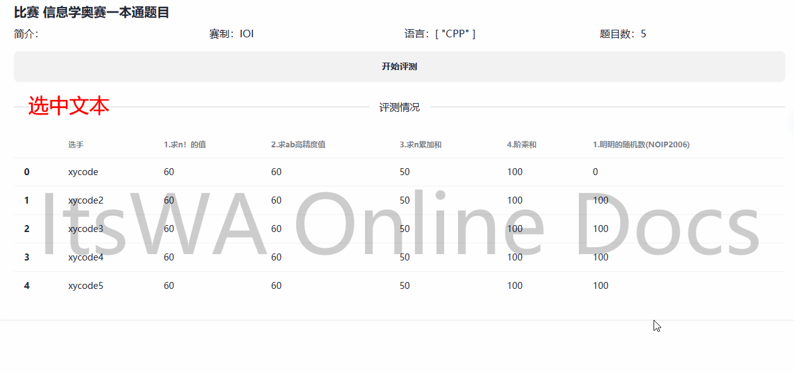

# 开始评测

首先，创建一个比赛。然后，从首页点击该比赛的**评测**按钮，进入评测页面。

进入评测页面后，点击**开始评测**，等待评测完成即可。

> 评测过程中，请勿刷新页面！

评测进度将会显示在ItsWA程序的日志中而非ITED。

## 评测结果展示

评测完成后，您可以看到各个选手每题的相关得分（注意：默认按照选手编号排序）。

点击分数，即可查看该题的得分概况（测试点状态），再次点击可以关闭。

## 评测结果分析与保存

> ITED不会保存评测数据！也不要尝试将该页面直接保存为HTML，因为这是使用Vue-Router开发的单页应用程序！

您可以用鼠标选中该表格并将其复制，然后粘贴到Excel等表格处理工具中，以进行进一步处理。

